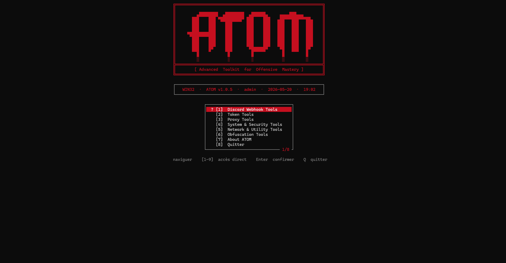

<p align="center">
  
</p>

<h1 align="center"> ATOM - Ultimate Multi-Tool </h1>

<p align="center">
  <strong>The most powerful Discord, OSINT, and System management suite built with .NET 10.</strong>
</p>

<p align="center">
  
  
  
</p>

---

## 🛠️ Tool Suite Overview

The **ATOM** engine is powered by a modular service architecture. Here is a breakdown of the specialized modules available in our toolkit:

### 🛡️ Security & Privacy
*   **Mac Spoofer**: Change your physical MAC address to bypass hardware bans.
*   **Security Guard**: Detects and removes malicious Discord client injections (BetterDiscord, Vencord, etc. if compromised).
*   **Obfuscator**: Advanced code protection for C#, Python, and JavaScript.
*   **Proxy Manager**: Integrated proxy scraping and validation system.

### 🎮 Discord Advanced
*   **Token Master**: Detailed account analysis (Nitro, Badges, Payment, Billing).
*   **Nuke Engine**: Full account reset (Server wipe, Friend removal, Settings reset).
*   **Mass DM**: High-speed direct messaging across all active conversations.
*   **Webhook Tool**: Webhook diagnostic, multi-threaded spammer, and secure deletion.
*   **Cleaner**: Automated guild exit, DM closure, and relationship cleanup.

### 🔍 OSINT & Networking
*   **Network Intelligence**: IP Geolocation, HWID retrieval, and connection analysis.
*   **QR Generator**: Create secure QR codes for tokens or custom data.

### ⚙️ System & Development
*   **DLL Injector**: Low-level x64 memory injector for process manipulation.
*   **Identity Faker**: Generates realistic fake identities, credit cards, and addresses.
*   **System Optimizer**: Deep clean of temporary files and crash logs.

---

## 🚀 Getting Started

### 📋 Prerequisites
- Windows 10/11
- [.NET 10.0 Runtime](https://dotnet.microsoft.com/download)

### 🛠️ Installation
```bash
# Clone the repository
git clone https://github.com/Redwxll-atm/Tools.git

# Enter the directory
cd Tools

# Build the project
dotnet build -c Release
```

## 📜 Legal Notice
This software is intended for **educational purposes only**. The developer is not responsible for any misuse. Please use responsibly and respect the Discord Terms of Service.

---

<p align="center">
  <i>Developed with ❤️ by <b>Redwxll</b></i>
</p>
